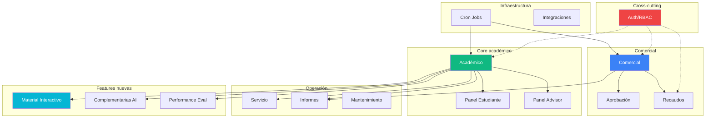
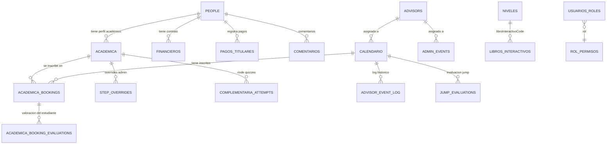
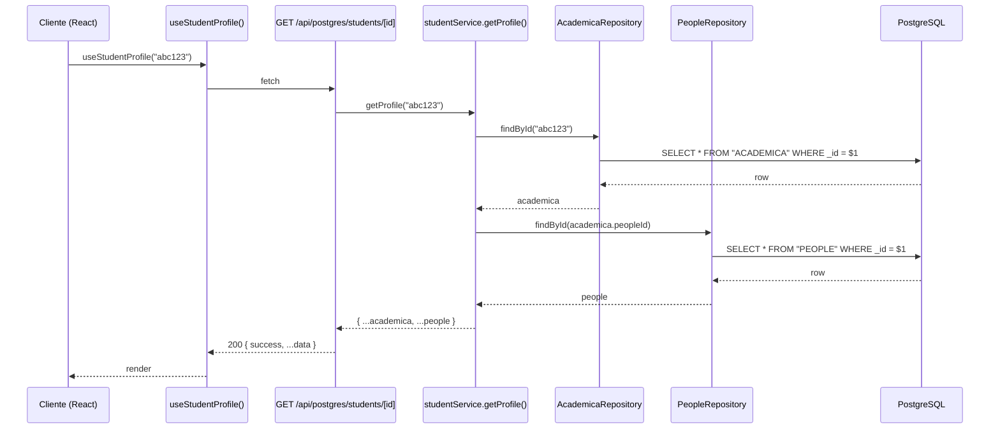

# Arquitectura del LGS Admin Panel

> Documento de referencia para entender la estructura del sistema.
> **Última actualización: 2026-06-09** — refleja el estado real del código,
> no aspiracional. Si encuentras divergencias, este doc está mal — actualízalo.

## TL;DR

- **Monolito modular** Next.js 14 (App Router) + PostgreSQL.
- **Una sola BD** (DigitalOcean managed) con 21 tablas.
- **5 capas** de separación bien definidas: Hook → API Route → Service → Repository → PostgreSQL.
- **Bajo acoplamiento** entre módulos: solo 5 cross-imports entre los 22 services.
- **14 módulos funcionales** organizados por dominio en `/dashboard/*` y `/admin/*`.

Métricas (junio 2026):

| Métrica | Valor |
|---|---|
| LOC TS/TSX | ~93,000 |
| Endpoints API | 225 |
| Páginas Next.js | 93 |
| Tablas PostgreSQL | 21 |
| Repositories | 21 |
| Services | 22 |

---

## 1. Las 5 capas

```mermaid
graph LR
  H[Hook<br/><i>useStudent()</i>] --> R[API Route<br/><i>app/api/postgres/...</i>]
  R --> S[Service<br/><i>student.service.ts</i>]
  S --> Rep[Repository<br/><i>people.repository.ts</i>]
  Rep --> DB[(PostgreSQL<br/><i>21 tablas</i>)]

  style H fill:#ec4899,color:#fff
  style R fill:#3b82f6,color:#fff
  style S fill:#10b981,color:#fff
  style Rep fill:#f59e0b,color:#fff
  style DB fill:#8b5cf6,color:#fff
```

### Reglas (NO romper)

1. **El hook nunca llama directo a un repository** — pasa por la API route.
2. **El service nunca ejecuta SQL** — pasa por el repository.
3. **El repository nunca contiene lógica de negocio** — solo SQL parametrizado (`$1, $2…`).
4. **El SQL siempre es parametrizado** (prevención de SQL injection).
5. **Todos los archivos server-side importan `'server-only'`** (evita bundle en cliente).
6. **Toda ruta API protegida usa `handler()` o `handlerWithAuth()`** de `@/lib/api-helpers`.

### Por qué esta estructura

| Beneficio | Cómo |
|---|---|
| Cambiar un campo en BD = cambiar 1 archivo (repo) | El service no sabe el SQL, solo llama métodos |
| Testear lógica de negocio sin BD = stub el repo | Service depende de un objeto, no de SQL |
| Permisos centralizados | `handler*()` wraps controlan auth |
| Errores tipados | `AppError` jerarquía: `NotFoundError`, `ValidationError`, `UnauthorizedError`, `ForbiddenError`, `ConflictError` |

---

## 2. Mapa de módulos (14 módulos funcionales)



### Detalle por módulo

| # | Módulo | Tablas | Repositories | Services | Acoplamiento al core |
|---|---|---|---|---|---|
| 1 | **Auth/RBAC** | `USUARIOS_ROLES`, `ROL_PERMISOS` | `roles` | — | Cross-cutting |
| 2 | **Académico** ★ | `NIVELES`, `CALENDARIO`, `ACADEMICA_BOOKINGS`, `STEP_OVERRIDES`, `ADVISORS`, `ADVISOR_EVENT_LOG`, `ADVISOR_NOTES_AUDIT`, `ADMIN_EVENTS`, `JUMP_EVALUATIONS` | `academica`, `booking`, `calendar`, `niveles`, `advisor`, `advisor-event-log`, `advisor-notes-audit`, `admin-events`, `jump-evaluation` | `calendar`, `enrollment`, `progress`, `student`, `student-booking`, `special-nivel`, `advisor-event-log`, `admin-events`, `jump-tutor` | **CORE** |
| 3 | **Comercial** | `PEOPLE`, `FINANCIEROS`, `COMENTARIOS` | `people`, `comments`, `financial` | `contract`, `consent`, `bloqueo-contrato` | Medio |
| 4 | **Recaudos** | `PAGOS_TITULARES` | `pagos-titulares` | `pagos-titulares` | Bajo |
| 5 | **Aprobación** | — (usa `PEOPLE.aprobacion`) | — | — | Medio |
| 6 | **Servicio** | — (usa `PEOPLE` + `CALENDARIO`) | — | `exam-intern` | Alto |
| 7 | **Mantenimiento** | `APP_CONFIG`, `MESSAGE_TEMPLATES` | `config`, `message-templates` | `usuarios-pegados`, `dblgs` | Bajo |
| 8 | **Material Interactivo** | `LIBROS_INTERACTIVOS` | `libros-interactivos` | `libros-interactivos` | Bajo |
| 9 | **Complementarias AI** | `COMPLEMENTARIA_ATTEMPTS` | `complementaria` | `complementaria` | Medio |
| 10 | **Performance Eval** | `ACADEMICA_BOOKING_EVALUATIONS` | `evaluations` | `evaluations` | Bajo |
| 11 | **Informes** | — (solo lectura, usa todas las del core) | — | `dashboard` | Alto (lectura) |
| 12 | **Paneles self-service** | — | — | `panel-estudiante`, `student-booking` | Alto |
| 13 | **Cron Jobs** | — | — | Worker separado (`scripts/cron-worker.js`) | Bajo |
| 14 | **Integraciones** | — | — | `lib/whatsapp.ts`, `lib/spaces.ts`, etc. | Bajo |

★ = núcleo del sistema (no se puede mover sin tocar todo).

---

## 3. Tablas PostgreSQL (21)



### Tablas auxiliares (sin relaciones explícitas en el diagrama)

- `APP_CONFIG` — Key-value para feature flags, ticker, banner
- `MESSAGE_TEMPLATES` — Plantillas WhatsApp con placeholders
- `ADVISOR_NOTES_AUDIT` — Audit log de ediciones a notas (append-only)
- `CRON_RUNS` — Healthcheck de jobs

---

## 4. Estructura de carpetas

```
src/
├── app/                          ← Next.js App Router
│   ├── api/                       ← 225 endpoints
│   │   ├── postgres/              ← API principal (estándar handler*)
│   │   ├── admin/                 ← Solo SUPER_ADMIN/ADMIN
│   │   ├── consent/               ← Consentimiento declarativo
│   │   ├── contracts/             ← Generación PDF
│   │   ├── cron/                  ← Jobs (CRON_SECRET)
│   │   ├── auth/                  ← NextAuth
│   │   └── ...
│   ├── dashboard/                 ← UI admin agrupada por dominio
│   │   ├── academic/              ← Módulo Académico
│   │   ├── aprobacion/            ← Módulo Aprobación
│   │   ├── comercial/             ← Módulo Comercial
│   │   ├── informes/              ← Módulo Informes
│   │   ├── recaudos/              ← Módulo Recaudos
│   │   └── servicio/              ← Módulo Servicio
│   ├── admin/                     ← Mantenimiento (17 sub-grupos)
│   ├── panel-estudiante/          ← Self-service estudiante
│   ├── panel-advisor/             ← Self-service advisor
│   └── ...                        ← /login, /student, /person, /sesion, etc.
│
├── repositories/                  ← 21 archivos — SOLO SQL
├── services/                      ← 22 archivos — lógica de negocio
├── hooks/                         ← React Query hooks
├── components/                    ← UI por feature
├── lib/                           ← Utilidades + clientes externos
│   ├── postgres.ts                ← Pool + helpers
│   ├── spaces.ts                  ← DO Spaces (S3-compatible)
│   ├── whatsapp.ts                ← Whapi.cloud
│   ├── auth-postgres.ts           ← NextAuth + PG
│   ├── api-helpers.ts             ← handler() / handlerWithAuth()
│   ├── api-permissions.ts         ← requirePermission()
│   └── ...
├── types/                         ← TypeScript shared
└── config/                        ← Catálogos (permisos, roles)

scripts/                           ← Migraciones idempotentes + utilidades
├── create-*.js                    ← CREATE TABLE IF NOT EXISTS
├── add-*-column.js                ← ALTER TABLE ADD COLUMN IF NOT EXISTS
├── backfill-*.js                  ← Data backfills (dry-run + --apply)
├── cron-worker.js                 ← Daemon de jobs (worker en DO)
└── upload-libro-interactivo.js    ← PDF → Spaces

docs/                              ← Documentación (este archivo)
public/                            ← Assets estáticos servidos directo
```

---

## 5. Cross-imports entre services (acoplamiento real)

Medición real (junio 2026) — solo 5 cross-imports entre los 22 services:

```
student.service.ts
  └─ exporta → autoAdvanceStep, changeStep
                  (usado por endpoints de attendance, evaluation, etc.)

student-booking.service.ts
  └─ exporta → getEffectiveStepNumber
                  (usado por student.service)

special-nivel.service.ts
  └─ exporta → promoteToDoneAndBlock
                  (usado por student.service para F3 → MASTER/IELTS/B2F/TOEFL)

progress.service.ts
  └─ exporta → generateReport
                  (usado por panel-estudiante.service)
```

**Conclusión**: los services están bien aislados. La cohesión es alta dentro de cada uno y el acoplamiento entre ellos es bajo.

---

## 6. Flujo de un request típico

Ejemplo: estudiante abre `/student/[id]` en el admin panel.



Notar: el **service combina** datos de 2 tablas. El **repository solo hace 1 query**.

---

## 7. Patrones especiales que existen

### Caché in-memory por módulo

Algunos services tienen caché module-level con TTL para reducir queries:

| Módulo | Qué cachea | TTL |
|---|---|---|
| `libros-interactivos.service` | Metadata por nivel + feature flag | 5 min / 1 min |
| `middleware-permissions` | Permisos por rol | 5 min |

Patrón típico:
```ts
const cache = new Map<string, { value: T; expires: number }>()
function getCached(key: string): T | undefined { /* ... */ }
function invalidate(key: string): void { /* ... */ }
```

Los endpoints admin que editan datos llaman `invalidate*()` después del UPDATE.

### Transacciones SQL

Helper `withTransaction(fn)` en `src/lib/postgres.ts` para operaciones atómicas:

```ts
return withTransaction(async (client) => {
  const baseRow = await CalendarioRepository.create(baseEventData, client)
  for (const adic of compartidoCon) {
    await CalendarioRepository.create(siblingData, client)
  }
  return baseRow
})
```

Usado en:
- Creación de eventos compartidos entre niveles
- Cambio de advisor en evento + log Suspended
- Cancelación con cascade

### JSONB para datos flexibles

Algunas tablas tienen campos JSONB para datos que cambian de estructura:

| Tabla | Campo JSONB | Contenido |
|---|---|---|
| `PEOPLE` | `onHoldHistory` | Historial de pausas |
| `PEOPLE` | `extensionHistory` | Historial de extensiones de contrato |
| `PEOPLE` | `consentimientoDeclarativo` | OTP + hash + timestamp |
| `ACADEMICA_BOOKINGS` | `evaluacion` | Calificación + comentarios |
| `LIBROS_INTERACTIVOS` | `audios` | Array de audios `{pagina, key, titulo}` |
| `STEP_OVERRIDES` | `notaoverrideHistory` | Audit log append-only |

`base.repository.ts` provee `parseJsonb()` para deserializar al leer.

### Cron jobs como worker separado

`scripts/cron-worker.js` es un daemon Node.js que corre como **Worker** en
Digital Ocean App Platform (`.do/app.yaml`). Llama a endpoints `/api/cron/*`
en horarios fijos:

| Job | Horario UTC | Hace |
|---|---|---|
| `reactivate-onhold` | 03:00 | Reactiva contratos cuyo OnHold expiró |
| `expire-contracts` | 04:00 | Marca contratos vencidos como FINALIZADA |
| `reconcile-pegados` | 02:00 | Reconciliación de steps de estudiantes pegados |

Cada ejecución se registra en `CRON_RUNS` para healthcheck.

---

## 8. Seguridad — checklist

| Aspecto | Implementación |
|---|---|
| SQL injection | SQL parametrizado (`$1, $2…`) en todos los repos |
| Auth | NextAuth.js con JWT; sesión leída por `getServerSession()` |
| RBAC | Permisos en `ROL_PERMISOS` (JSONB) + middleware route-level + `<PermissionGuard>` UI |
| CSRF | NextAuth maneja CSRF |
| Cookies seguras | `httpOnly`, `secure`, `sameSite` |
| Headers no-cache en rutas protegidas | `noCacheNext()` helper |
| Audit logs | `ADVISOR_NOTES_AUDIT`, `MATERIAL_AUDIT`, `PURGE_LOG`, `auditautoaprov`, `STEP_OVERRIDES.notaoverrideHistory` |
| Cron auth | `CRON_SECRET` header obligatorio |
| Presigned URLs Spaces | TTL 10 min para imágenes/audios, 2h para videos |
| Cross-app SSO | `/api/auth/crm-bridge` con HMAC |

---

## 9. Recursos relacionados

- `CLAUDE.md` — Doc operativa exhaustiva (este archivo es resumen estructural)
- `scripts/` — Todos los scripts de migración y utilidad
- `/admin/scripts/consulta` — Visor del catálogo de scripts en runtime
- `/admin/diagnostico` — Mide TTFB/DNS/TCP por endpoint
- `/dblgs` — Visor de BD (DBA-light)

---

## 10. Cómo actualizar este documento

Cuando el sistema cambie:

1. **Nuevo módulo** → agregar fila en la tabla §2 + nodo en el diagrama Mermaid
2. **Nueva tabla** → agregar al ER diagram §3
3. **Nuevo cross-import entre services** → actualizar §5
4. **Nuevo patrón arquitectónico** → agregar a §7

Métricas para volver a medir:

```bash
# LOC
find src -name "*.ts" -o -name "*.tsx" | xargs wc -l | tail -1

# Endpoints
find src/app/api -name "route.ts" | wc -l

# Páginas
find src/app -name "page.tsx" | wc -l

# Tablas
grep -h 'FROM "\|UPDATE "\|INSERT INTO "' src/repositories/*.ts | grep -oE '"[A-Z_][A-Z_0-9]*"' | sort -u | wc -l

# Cross-imports entre services
grep -hE "^import.*services/" src/services/*.ts | grep -v "@/lib\|@/repositories\|@/types\|errors\|api-helpers" | sort -u
```
